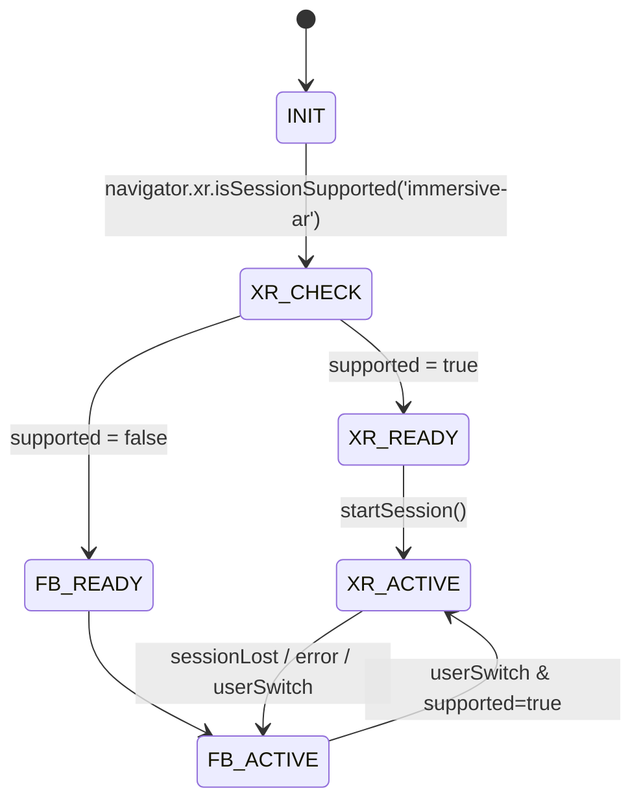

# 詳細設計書

要件定義書（詳細改訂版）を実装可能な粒度に落とし込んだ**詳細設計**です。
A: **WebXR（Hit Test）** を第一候補、B: **Fallback（スクリーン座標）** を自動切替。
**モデル追加（ユーザ選択）**、**1080p表示＋推論解像度分離**、**ジェスチャー操作**、**資産リゾルバ**、**HUD/設定**、**安全設計**を含みます。

---

## 1. 全体アーキテクチャ

```mermaid
graph LR
  subgraph Electron Main
    M1[AppBootstrap]
    M2[IPC Router]
    M3[Settings Store (electron-store)]
    M4[File Dialog]
  end

  subgraph Renderer
    R0[App Shell]
    R1[XRModeManager A/B]
    R2[VideoPipeline 1080p要求/降格]
    R3[HandTracker (MediaPipe Tasks WASM)]
    R4[GestureSolver (pinch/scale/rotate)]
    R5[SceneCore (three.js)]
    R6[MMDSubsystem (AssetResolver + MMDLoader)]
    R7[FallbackController (raycast/pseudoZ)]
    R8[XRController (HitTest/Anchors)]
    R9[HUD & Settings UI]
  end

  M2 <--> R0
  R0 --> R1
  R0 --> R2 --> R3 --> R4 --> R5
  R1 --> R8
  R1 --> R7
  R6 --> R5
  R9 --> R0
```

### レイヤ責務

* **Main**: ウィンドウ生成・セキュアIPC・設定永続化・ファイルダイアログ
* **Renderer**:

  * **VideoPipeline**: `getUserMedia`（1080p要求/降格）、フレーム供給
  * **HandTracker**: MediaPipe Tasks（WASM）初期化と推論、平滑化
  * **GestureSolver**: ランドマーク→掴む/移動/回転/拡大縮小
  * **XRController(A)**: WebXR `immersive-ar`/Hit Test/Anchors/Plane（ある場合）
  * **FallbackController(B)**: スクリーン座標→レイキャスト、擬似Z、慣性
  * **MMDSubsystem**: モデル追加（ユーザ選択）、資産解決、MMDLoader
  * **SceneCore**: three.jsシーン/光源/床/ギズモ/HUD

---

## 2. 実行モード管理（A/B自動切替）



### 切替ロジック（擬似コード）

```ts
enum XRMode {"auto","xr","fallback"}
enum RunState {"INIT","XR_READY","FB_READY","XR_ACTIVE","FB_ACTIVE"}

async function selectMode(userPref: XRMode): Promise<RunState> {
  const supported = await xrIsSupported('immersive-ar');
  if (userPref === "xr") return supported ? "XR_READY" : "FB_READY";
  if (userPref === "fallback") return "FB_READY";
  // auto
  return supported ? "XR_READY" : "FB_READY";
}
```

---

## 3. Electron Main 設計

### ウィンドウ/セキュリティ

* `BrowserWindow` オプション:

  * `webPreferences`: `{ contextIsolation: true, sandbox: true, nodeIntegration: false, preload: <path> }`
* 通信: **preload** で**限定API**を`contextBridge.exposeInMainWorld`
* **権限**: カメラはRendererで要求（OS側許可はユーザ操作）

### 設定永続化（electron-store）

* ファイル: `userData/config.json`
* バリデーション: Renderer側の\*\*スキーマ（zod）\*\*で検証した上で保存

### IPC 契約（Main）

```ts
// Renderer -> Main
"dialog/open-model"(): Promise<{ canceled: boolean; filePath?: string }>
"settings/get"(): Promise<AppSettings>
"settings/set"(next: Partial<AppSettings>): Promise<void>

// 将来拡張
"app/restart"(): Promise<void>
```

### ファイルダイアログ

* フィルタ: `[{ name: "MMD Model", extensions: ["pmx"] }]`
* **Drag\&Drop**はRenderer側でパス受理 → **検査はRendererで実施**（拡張子/サイズ/正規化）

---

## 4. Renderer：コア設計

### 4.1 App Shell

* 起動順: 設定ロード → XR可否判定 → VideoPipeline開始 → HandTracker初期化 → SceneCore → XR/A起動 or B起動 → HUD開始
* **グローバルイベント**: 設定変更・モード切替・モデル読み込み・一時停止/再開

### 4.2 VideoPipeline（1080p要求/降格）

```ts
type CamLevel = "1080p" | "720p" | "480p";
const constraints: Record<CamLevel, MediaStreamConstraints> = {
  "1080p": { video: { width: { ideal: 1920 }, height: { ideal: 1080 }, frameRate: { ideal: 30 } } },
  "720p":  { video: { width: { ideal: 1280 }, height: { ideal: 720  }, frameRate: { ideal: 30 } } },
  "480p":  { video: { width: { ideal: 640  }, height: { ideal: 480  }, frameRate: { ideal: 30 } } }
};

async function openCameraPrefer1080p(): Promise<{stream: MediaStream, level: CamLevel}> {
  for (const lv of ["1080p","720p","480p"] as const) {
    try { return { stream: await navigator.mediaDevices.getUserMedia(constraints[lv]), level: lv }; }
    catch { /* try next */ }
  }
  throw new Error("No camera available");
}
```

* **提供**: `<video>` 要素と `ImageBitmap`/`HTMLCanvasElement` を HandTracker に供給
* **メトリクス**: 実測fps、解像度、ドロップフレーム

### 4.3 HandTracker（MediaPipe Tasks / WASM）

* 初期化パラメタ: `numHands=2`, `minDetectionConfidence=0.5`, `minTrackingConfidence=0.5`
* **入力解像度**は別管理（例: 480p）。`createImageBitmap`で縮小 or OffscreenCanvasで`drawImage`縮小。
* **推論ループ**: 表示fps 30 に対し 推論fps 15–30（間引き可）
* 出力: 正規化ランドマーク（21点 × 最大2手）＋信頼度＋ handedness
* **平滑化**: デフォルトEMA、OneEuro切替可

  * EMA: `x_s = α x + (1-α) x_prev`（位置: α=0.5、角: α=0.7 初期）
  * OneEuro: `minCutoff, beta, dCutoff` を設定UIで編集可能

### 4.4 GestureSolver（操作マッピング）

* **掴む/離す**:

  * `d = ||p_thumb - p_index||`（画像正規化空間）。`d < T_grab` → 掴む、`d > T_release` → 離す（ヒステリシス）
  * 既定: `T_grab=0.035`, `T_release=0.045`
* **移動**: 掴み中のみ、**手の中心**（手首・掌基部平均）スクリーン座標→A/Bに渡す
* **回転**: 手首向き（手首→中手基部ベクトル）の水平角 → Yaw
* **拡大縮小**: **両手**の中心距離 `dist/dist0` をスケールへ
* **スロープ制御**: 最大角速度/移動速度/スケール速度をクリップ

### 4.5 XRController（A: WebXR）

* `isSessionSupported('immersive-ar')` → `requestSession('immersive-ar', { requiredFeatures: ['hit-test'], optionalFeatures: ['anchors','plane-detection'] })`
* **Hit Test**:

  * 画面中心レイ or タップ位置レイで `XRHitTestSource` 作成
  * `XRFrame.getHitTestResults(source)` → 最前の結果で姿勢取得
* **Anchors**（存在時）: `result.createAnchor()` → threeオブジェクトの親に
* **Reticle**: 半透明円＋法線矢印をthree.jsで表示（ヒット無→非表示）
* **合成**: three.jsの `renderer.xr.enabled = true`、WebXRカメラを使用

### 4.6 FallbackController（B: スクリーン座標）

* **擬似平面**: `Z = Z0`（初期 1.2m 相当）
* **レイキャスト**: 画面座標→カメラ空間レイ→平面交差点
* **擬似Z制御**: ピンチ強度 or 両手距離 → Z を `[Zmin,Zmax]` で線形変換
* **慣性**: `v = clamp(v + a*dt, vmax)`, 解放時は指数減衰

### 4.7 SceneCore（three.js）

* レンダラ: `WebGLRenderer({ antialias: true, alpha: true })`
* カメラ: `PerspectiveCamera(fov=60, aspect=videoAspect, near=0.01, far=20)`
* 光源: `HemisphereLight` + `DirectionalLight`（シャドウは中/高のみ）
* **床**:

  * A: Hit Testで得た法線/ポーズに併せる（オプション）
  * B: 視覚的床（半透明グリッド）
* **HUD**: 左上テキスト（fps/ifps/ms/mode/hands/conf）

### 4.8 MMDSubsystem（モデル追加/資産リゾルバ）

* **流れ**:

  1. `Cmd/Ctrl+O` or D\&D → パス取得
  2. 拡張子 `.pmx` のみ許可、サイズ上限（200MB）
  3. **資産解決**: `.pmx`内参照テクスチャの相対パスを**正規化**。`..`トラバーサル拒否
  4. 大型テクスチャは最大辺（例: 4096）でリサイズ提案（任意）
  5. `MMDLoader` でロード → **初期フィット**（BBからスケーリング）
  6. `recentModels` 更新
* **初期フィット**：

  * `const s = targetScreenHeightPct / modelBBHeightOnScreen`（例: 0.35）
  * `scale.setScalar(s)`、位置はカメラ前 Z=1.2m 付近

---

## 5. UI/UX 詳細

### メニュー/ショートカット

* ファイル > **モデルを開く…**（`Cmd/Ctrl+O`）
* 表示 > HUD（H）
* 表示 > XRモード（Auto/XR/FB）
* 操作 > リセット（R）
* 操作 > 一時停止（Space）

### 設定パネル（右スライド）

* 解像度（表示: 1080p/720p、推論: 360/480/720）
* XRモード（Auto/XR/FB）
* 品質（低/中/高：影/PMREM/ポスト）
* 物理 ON/OFF（床衝突のみ）
* ジェスチャー閾値（grab/release）、Gain（move/rot/scale）
* 平滑化（EMA αpos/αrot or OneEuro params）

### モデル追加UI

* 進捗バー、キャンセル
* 欠損ファイルエラー（一覧表示）
* 最近使ったモデル（最大10件、Path表示、ない場合は自動削除）

---

## 6. データモデル/設定

### 設定スキーマ（zod例）

```ts
const SettingsSchema = z.object({
  displayResolution: z.enum(["1080p","720p"]),
  inferenceResolution: z.enum(["360p","480p","720p"]),
  xrMode: z.enum(["auto","xr","fallback"]),
  quality: z.enum(["low","medium","high"]),
  physics: z.boolean(),
  hud: z.boolean(),
  gesture: z.object({
    grab: z.number().min(0.0).max(0.2),
    release: z.number().min(0.0).max(0.3),
    scaleFactor: z.number().min(0.1).max(5),
    rotationGain: z.number().min(0.1).max(5),
    moveGain: z.number().min(0.1).max(5),
  }),
  smoothing: z.object({
    type: z.enum(["ema","one_euro"]),
    alphaPos: z.number().min(0.0).max(1.0),
    alphaRot: z.number().min(0.0).max(1.0),
    // one Euro (optional)
    minCutoff: z.number().optional(),
    beta: z.number().optional(),
    dCutoff: z.number().optional(),
  }),
  recentModels: z.array(z.object({
    path: z.string(),
    lastOpenedAt: z.number()
  })).max(10),
  scene: z.object({
    position: z.tuple([z.number(),z.number(),z.number()]),
    rotationEuler: z.tuple([z.number(),z.number(),z.number()]),
    scale: z.number()
  })
});
```

---

## 7. IPC 詳細

### preload.ts（抜粋）

```ts
contextBridge.exposeInMainWorld("api", {
  openModelDialog: () => ipcRenderer.invoke("dialog/open-model"),
  getSettings:      () => ipcRenderer.invoke("settings/get"),
  setSettings:      (next) => ipcRenderer.invoke("settings/set", next),
});
```

### Renderer 側型

```ts
declare global {
  interface Window {
    api: {
      openModelDialog(): Promise<{canceled:boolean; filePath?:string}>;
      getSettings(): Promise<AppSettings>;
      setSettings(next: Partial<AppSettings>): Promise<void>;
    }
  }
}
```

---

## 8. エラーハンドリング設計

| コード                 | 発生箇所  | 原因               | ハンドリング            |
| ------------------- | ----- | ---------------- | ----------------- |
| E\_CAM\_DENIED      | Video | OSでカメラ拒否         | エラーダイアログ＋ダミー映像モード |
| E\_CAM\_UNAVAILABLE | Video | デバイスなし           | 同上                |
| E\_XR\_UNSUPPORTED  | XR    | `immersive-ar`不可 | 自動FB切替＋トースト表示     |
| E\_XR\_SESSION      | XR    | セッション開始失敗/喪失     | FBへフェイルバック        |
| E\_PMX\_EXT         | MMD   | 拡張子不正            | ダイアログで拒否          |
| E\_PMX\_SIZE        | MMD   | サイズ超過            | ユーザ確認（続行/中止）      |
| E\_TEX\_MISSING     | MMD   | 相対参照欠損           | プレースホルダ適用＋一覧提示    |
| E\_OOM              | 全体    | VRAM/メモリ不足       | 解像度/品質を下げる案内      |
| E\_TRACKING         | Hand  | 推論停止/例外          | 再初期化試行、失敗で停止      |

ログ：`console`＋（必要なら）ファイル出力（日付ローテーション）。

---

## 9. パフォーマンス設計

* **表示1080p／推論可変**（360–720p）
* **推論間引き**：`if (t - lastInfer < 66ms) skip`（15fps時）
* **テクスチャ**：大サイズはダウンサンプル（ミップON）。KTX2 対応は将来課題
* **OffscreenCanvas**：推論前の縮小/前処理で利用（対応環境）
* **GC抑制**：`createImageBitmap`再利用／バッファリング
* **シーン最適化**：ポリゴン数の上限ドキュメント化（例: 100k–200k頂点程度を推奨）

HUD計測：表示fps、推論fps、推論ms、ドロップ率

---

## 10. セキュリティ

* `contextIsolation: true`, `sandbox: true`, `nodeIntegration: false`
* IPCペイロードを**スキーマ検証**、パスは**正規化**し `..` 拒否
* ネットワーク通信**なし**（外部送信禁止）
* D\&Dのファイルは**拡張子/サイズ**をチェック

---

## 11. テスト計画

### 単体

* 資産リゾルバ：相対パス正規化・欠損検出・キャッシュ
* GestureSolver：閾値/ヒステリシス/回転・スケール計算
* OneEuro/EMA：既知波形に対する応答

### 結合

* 1080p要求→720p降格、推論fps変化がHUDに反映
* モデル追加→初期フィット→操作一連
* XR可否→A/B切替、セッション喪失→FB

### システム

* 連続60分でfps・メモリ・温度（参考）が安定
* 大容量PMXでのUI応答維持
* カメラ拒否/無効時の導線

**受入**：要件書の受入基準をすべて満たすこと（A: ≤120ms、B: ≥24fps、モデル追加UX、外部送信なし）。

---

## 12. ディレクトリ構成（最終）

```
/project
  ├─ main/
  │   ├─ index.ts
  │   ├─ ipc.ts
  │   └─ store.ts
  ├─ preload/
  │   └─ index.ts
  ├─ renderer/
  │   ├─ app/App.tsx
  │   ├─ core/SceneCore.ts
  │   ├─ xr/XRController.ts
  │   ├─ fb/FallbackController.ts
  │   ├─ vision/VideoPipeline.ts
  │   ├─ vision/HandTracker.ts
  │   ├─ gestures/GestureSolver.ts
  │   ├─ mmd/AssetResolver.ts
  │   ├─ mmd/MMDSubsystem.ts
  │   ├─ ui/SettingsPanel.tsx
  │   └─ ui/HUD.tsx
  ├─ shared/types.ts
  ├─ assets/ (規約クリアのダミーのみ)
  └─ package.json
```

---

## 13. 主要モジュールの擬似コード

### 13.1 HandTracker（MediaPipe Tasks）

```ts
import { HandLandmarker, FilesetResolver } from "@mediapipe/tasks-vision";

class HandTracker {
  private landmarker: HandLandmarker;
  private inferIntervalMs = 33; // ~30fps (設定で可変)

  async init(wasmBaseUrl: string) {
    const fileset = await FilesetResolver.forVisionTasks(wasmBaseUrl);
    this.landmarker = await HandLandmarker.createFromOptions(fileset, {
      baseOptions: { modelAssetPath: "hand_landmarker.task" },
      numHands: 2,
      minDetectionConfidence: 0.5,
      minTrackingConfidence: 0.5,
      runningMode: "VIDEO"
    });
  }

  async infer(videoOrBitmap: HTMLVideoElement|ImageBitmap, ts: number): Promise<HandResult> {
    const res = await this.landmarker.detectForVideo(videoOrBitmap, ts);
    // 平滑化 & 整形
    return smoothAndFormat(res);
  }
}
```

### 13.2 GestureSolver

```ts
class GestureSolver {
  state = { grabbing:false, dist0:1, scale:1, yaw:0 };
  params = { T_grab:0.035, T_release:0.045, moveGain:1, rotationGain:1, scaleFactor:1 };

  update(hands: HandLandmarks): GestureOutput {
    // 片手ピンチ判定
    const d = distance(hands.primary.thumb, hands.primary.index);
    if (!this.state.grabbing && d < this.params.T_grab) this.state.grabbing = true;
    if ( this.state.grabbing && d > this.params.T_release) this.state.grabbing = false;

    // 両手スケール
    if (hands.count === 2 && this.state.grabbing) {
      const dist = centerDistance(hands.left.center, hands.right.center);
      if (!isFinite(this.state.dist0)) this.state.dist0 = dist;
      this.state.scale = clamp(this.params.scaleFactor * dist / this.state.dist0, 0.2, 3.0);
    }

    // 回転（水平角）
    const yaw = horizontalAngle(hands.primary.wristVec) * this.params.rotationGain;

    // 移動
    const move = screenDelta(hands.primary.center) * this.params.moveGain;

    return { grabbing: this.state.grabbing, scale:this.state.scale, yaw, move };
  }
}
```

### 13.3 XRController（Hit Test）

```ts
class XRController {
  session?: XRSession;
  hitSource?: XRHitTestSource;

  async start(renderer: THREE.WebGLRenderer) {
    renderer.xr.enabled = true;
    this.session = await navigator.xr.requestSession("immersive-ar", { requiredFeatures:["hit-test"] });
    renderer.xr.setSession(this.session);
    const refSpace = await this.session.requestReferenceSpace("local");
    const viewerSpace = await this.session.requestReferenceSpace("viewer");
    this.hitSource = await this.session.requestHitTestSource({ space: viewerSpace });

    this.session.requestAnimationFrame((t, frame) => this.onXRFrame(t, frame, refSpace));
  }

  onXRFrame(t: DOMHighResTimeStamp, frame: XRFrame, refSpace: XRReferenceSpace) {
    const results = frame.getHitTestResults(this.hitSource!);
    if (results.length > 0) {
      const pose = results[0].getPose(refSpace);
      // reticle更新／アンカー or 直置き
    }
    // three.jsの描画は renderer.setAnimationLoop 側で
  }
}
```

### 13.4 FallbackController（レイキャスト）

```ts
class FallbackController {
  Z = 1.2; // m
  updateFromScreenPoint(pt: {x: number, y: number}, camera: THREE.Camera): THREE.Vector3 {
    const ray = new THREE.Raycaster();
    ray.setFromCamera(pt, camera);
    const t = (this.Z - ray.ray.origin.z) / ray.ray.direction.z;
    return ray.ray.at(t, new THREE.Vector3());
  }
}
```

### 13.5 MMDSubsystem（モデル追加）

```ts
class MMDSubsystem {
  async openModel(path: string) {
    validatePmxPath(path);
    const resolved = await resolveAssets(path); // テクスチャ相対参照の正規化/存在確認
    const loader = new MMDLoader();
    const mesh = await loader.loadAsync(path); // テクスチャはloader側で解決（必要に応じフック）
    fitToView(mesh);
    scene.add(mesh);
    addRecent(path);
  }
}
```

---

## 14. ビルド/依存/スクリプト

* Node 20+ / pnpm or npm
* 主要依存：

  * `electron`, `electron-store`
  * `three`（含: `examples/jsm/loaders/MMDLoader.js`）
  * `@mediapipe/tasks-vision`
  * `zod`（設定検証）
  * 任意: `cannon-es`
* スクリプト（例）：

  * `dev`: Vite + Electron（2プロセス起動）
  * `build`: Electron Builder（**PoC内配布想定なし**）
  * `postinstall`: three/examples の型/アセットコピー

---

## 15. マイルストーン & 受入（工程対応）

1. **起動骨格 & 設定/HUD**（A/B判定・1080p要求・HUD表示）
2. **HandTracker**（WASM初期化・推論・平滑化）
3. **Fallback(B)** 完了（掴む/移動/回転/拡大縮小）
4. **MMD追加**（資産リゾルバ・初期フィット・最近リスト）
5. **WebXR(A)**（Hit Test・レティクル・設置・（可能なら）Anchors）
6. **品質/物理/最適化**（任意ON、デフォルトOFF）
7. **総合テスト**（受入基準満足：A≤120ms、B≥24fps、1080p要求と降格）

---

## 16. リスク再掲と運用メモ

* **WebXR**: デスクトップでは不可のことが多い → **B設計を必ず完成**させる
* **モデル規約**: **同梱なし・ユーザ選択**のみ／公開配布しない
* **性能**: 表示1080pは維持しつつ**推論は可変**・間引き・品質段階を提供
* **安定**: 掴み中のみ操作を適用、ヒステリシス・スロープで跳ねを抑制

---

